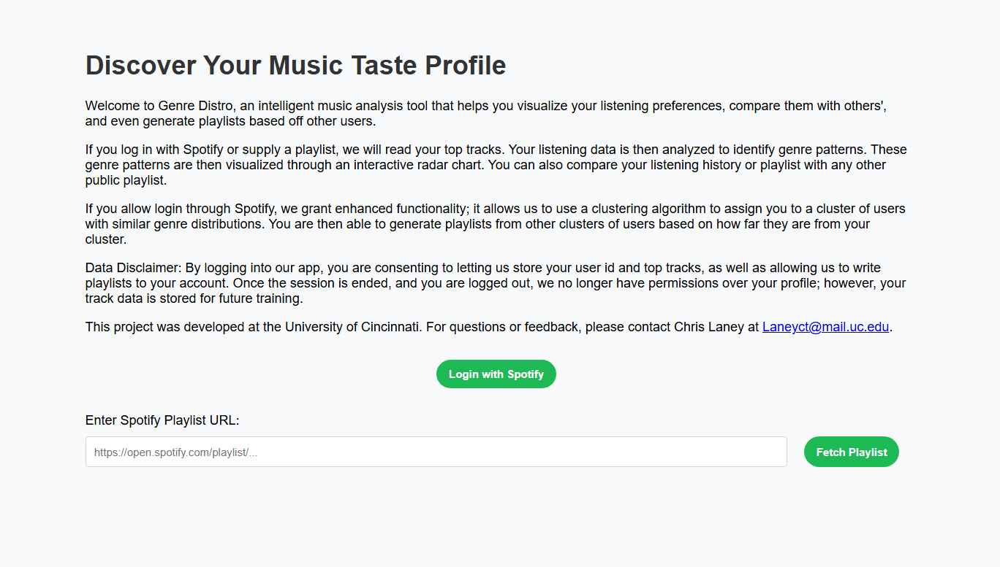
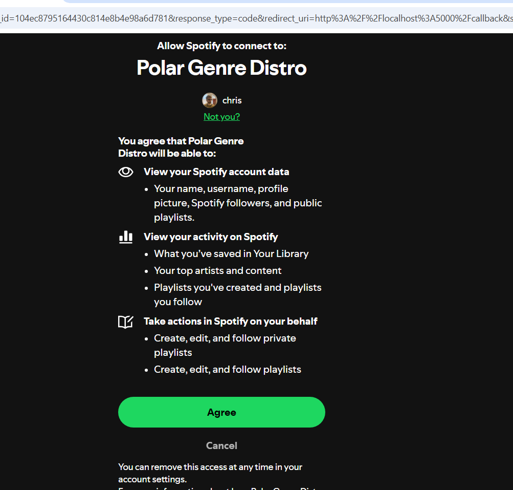
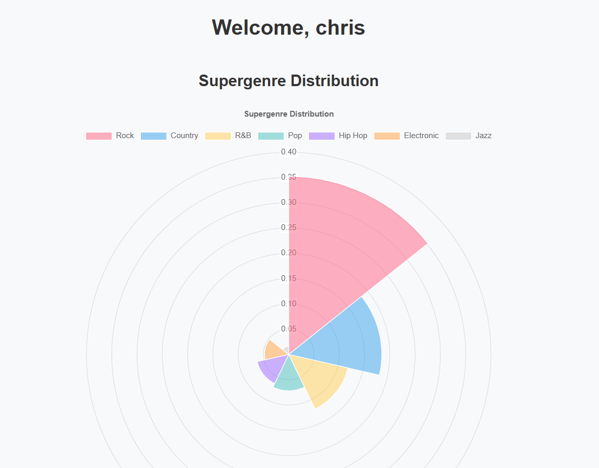
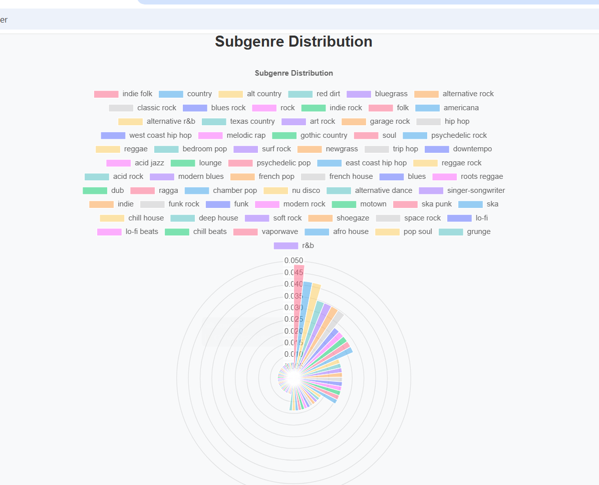
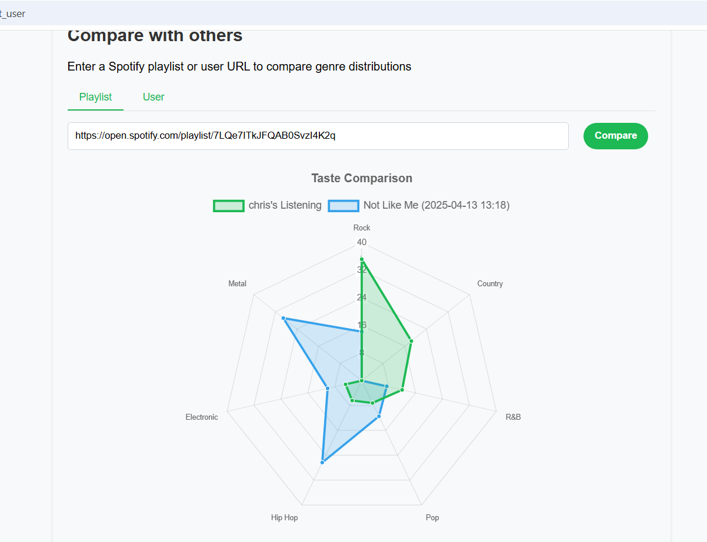
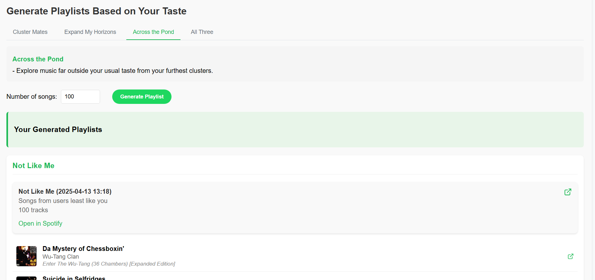

# SpotifyStats

# Final Fall Design Report

## Table of Contents
1. [Team and Project](#team-and-project)
2. [Project Description](#project-description)
3. [User Stories and Design Diagrams](#user-stories-and-design-diagrams)
   - [User Stories](#user-stories)
   - [Design Diagrams](#design-diagrams)
4. [Project Tasks and Timeline](#project-tasks-and-timeline)
   - [Task List](#task-list)
   - [Timeline](#timeline)
   - [Effort Matrix](#effort-matrix)
5. [ABET Concerns Essay](#abet-concerns-essay)
6. [PPT Slideshow](#ppt-slideshow)
7. [Self-Assessment Essays](#self-assessment-essays)
8. [Professional Biographies](#professional-biographies)
9. [Budget](#budget)
10. [Appendix](#appendix)

---

## Team and Project
**Team Members:**  

**William Hawkins** - Faculty Advisor   
Email: [hawkinwh@ucmail.uc.edu](mailto:hawkinwh@ucmail.uc.edu)

---

**Seamus Collins** - Computer Science Student   
Email: [colli2sc@mail.uc.edu](mailto:colli2sc@mail.uc.edu)

**Noah Falanga** - Computer Science Student   
Email: [falangnm@mail.uc.edu](mailto:falangnm@mail.uc.edu)

**Chris Laney** - Computer Science Student   
Email: [Laneyct@mail.uc.edu](mailto:Laneyct@mail.uc.edu)

**Justin Tisch** - Computer Science Student   
Email: [tischjl@mail.uc.edu](mailto:tischjl@mail.uc.edu)

---

**Project Abstract:**  

SpotifyStats (genre distro) is a web application that will transform users' Spotify listening data into meaningful insights and personalized music recommendations. Through an engaging visualization and interpretation of their historic listening data and future recommendations we are able to provide users with astute genre analysis. This app parses the genre of users top songs and then provides sub-genre and super-genre distributions, for top songs, playlists, and other users on our app as well. We compare multiple users distributions via a radar chart, and a singular users own distributions using polar area charts. In the backend a K means cultering algorithm clusters users based on their genre distributions and is able to make reccomendations based on that. 

---

## Project Description

SpotifyStats is web application that combines Spotify analytics with personalized music recommendations, presented through an engaging interface. The platform will integrate with Spotify's library through a structured architecture of frontend and backend components.
The backend will consist of two primary components. The main parser will utilize Spotipy, a Python library for Spotify API integration, to handle user authentication and data retrieval. This component will pull user data, clean it, and organize it for distribution to both the frontend visualizations and the recommendation algorithm. The recommendation system will analyze users' listening patterns to generate tailored music suggestions.
The frontend will feature two main sections: listening history analytics and music recommendations. The analytics section will showcase interactive visualizations of user listening patterns, while the recommendation section will present suggested tracks through an intuitive list interface, potentially enhanced by a user survey system for preference fine-tuning.
The technical architecture will include a robust error reporting system for API interactions and a centralized data access layer for standardized data retrieval. This structure will ensure efficient troubleshooting and streamlined development processes.
Through the combination of detailed analytics, intelligent recommendations, clean user interface design, SpotifyStats will offer users an innovative platform for exploring their music preferences and discovering new artists aligned with their tastes.

---

##  User Interface Specification
The user interface is composed of a few different functional pieces. The initial is the index.html or landing page. This is where a user must log in to spotify to authenticate their account information with us, and give us permission to pull data. Or their is a non login method where they can input a public playlist URL and get the distribution breakdown from that, with no account info. Once a user is authenticated (or not) it will take them to the dashboard side of our project. Which for non-logged in users, will only consist of the first part of these deliverables. There will be 2 polar area charts and a list with percentages of super-genre distribution and sub-genre distribution, respectively. Then a user and scroll down to the compare section where users can compare on a radar chart their own listening distribution with that of either another user in our database via their account share link or a publically available (non spotify made) playlist. This will plot each of their respective distributions on a radar chart showing overlap and variance within the graphic. The third and final part is that of the playlist recommendation / generation aspect. A user then has the ability to click "generate playlists" and 3 possible playlist options could be generated. A playlist with songs that the user likely knows and or enjoys, a playlist with some new music but also some familiar music, and a playlist with music that the user likely does not know. Once generated these playlists will be automatically be added to the users account. 

## Test Plan and Results
Our testing approach holds a combination of objective tests and subjective tests that may be difficult to quantify. Our plan is to first test the necessary, quantifiable test cases, such as verifying that our API endpoints are functional, that are databases are connected, and that performance is accurate. After this, we will be testing the result of our similarity algorithm, which is at least in part subjective, such that users are as representative of both users’ tastes. Finally, we will make sure that the UI is aesthetically pleasing and intuitive.
#### Test Cases:
1)	Fast Load Time Test Case; 
This test is to ensure that users are admitted to the webapp quickly
This test will ensure that all users apps load in less than a minute
Input; user login / Auth 
Output; Home page
Normal Boundary
Black Box
Performance
Unit Test
 
Results; Initial user load takes about 10 seconds which meets our standard. Depending on wifi the playlists are typically generated in 15 seconds upon click, which does meet our standard

3)	Access Spotify Data
This is the test to make sure that the program can successfully pull data from Spotify.
This test will access data from Spotify after a user authorizes our program.
Input: User Login / OAuth
Output: Interface with user data
Normal Boundary
White Box
Functional
Integration Test
Results; All data was accurately pulled and parsed using dictionaries, determining we were traversing the dictionary correctly.

5)	Data is Saved to Database
This test is to ensure that data is properly saved upon new user login/user data expiration.
Input: user login/Auth
Output: User data is stored properly in database
Normal Boundary
Blackbox
Functional
Unit
Results; User data we wanted was saved correctly to the database using standard user schema.

7)	Database Connection Test
This test is to ensure that our program can connect to a cloud database to store data in.
Input: database login
Output: successful connection
Normal Boundary
Blackbox
Functional
Integration
Results; Confirmed by induction of the testcase before this. 

9)	Plot Display Test
The purpose of this test is to verify that, upon request, a user will be able to see themselves upon other users and examine how similar they are to each other. The plot should be interactive and believable based on the songs that are available upon user request.
Input: User’s song data
Output: interactive plot of users and their top songs, similarity score
Normal
Whitebox
Functional
Integration
Results; User data able to be plotted on polar area chart as well as radar chart. 

11)	Spider Chart Works
This test is to ensure a user’s homepage contains a spider chart of their Super Genres
This test makes sure the user has a spider chart of their super genres displayed when they log into SpotifyStats.
Input: User’s Super Genre distribution
Output: Super Genre Spider Chart
Normal Boundary
White Box
Functional
Integration
Results; Confirmed by induction of the test case above. All plotting and graphing functions do as necessary 

13)	Super Genre Map Helper
This is to ensure that a users songs are mapped to the correct genre 
This will cross reference users subgenres to the super genre map to make sure their genre distributions are accurate
Input: List of users genres from top 100 songs
Output: Genre Distribution
Normal Boundary 
Black Box
Functional
Unit Test
Results; This works as intended except for the fact that some subgenres do not map to supergenres due to the mapping key we used. In this event we are logging those to a text document for later update. 

15)	User Similarity Ranking
This is to ensure that user similarity/dissimilarity rankings work to subjective and objective criteria
Will use test users and manual data to validate rankings 
 inputs: test users that have only listened to specified genre playlists
 outputs: test users rankings compared to other users  
 Normal boundary 
White Box
Functional
Integration
Results; Done via a k-means solution but other algos were tested for similarity purposes. This happened to be the best.

17)	User Interface Data Transfer Efficiently
Ensure efficient data transfer from backend to front end graphs
Input: Data objects from parser
Output: Data objects in front end
Normal Boundary
Black Box
Performance
Unit test
Results; Confirmed via induction of test case 1, 9 and 11 where we test speed and the plotting accuracy of graphs

19)	User Interface Data Transfer Correctly
Ensure clean data transfer from middleware/parser to front end graphs
Input: Data objects from parser
Output: Data objects in front end / Correct graphs
Normal Boundary
Black Box
Functional
Unit test
Results; Confirmed user data does transfer correct and is plotted to an accurate representation of the data points.

21)	User Accessibility Test
Ensure that our site is easily navigable and understandable by the average user.
Input: Non-developer user navigating the website
Output: Review of the site’s accessibility
Normal Boundary
White Box
Performance
Integration
Results; Non project civilizians tested the site and confirmed easy navigation and ability to infer purpose.

## User Manual

Upon typing in the link you will be presented with this landing / homepage. Infront of you lies 2 paths. The first button logs into and authenticates a users spotify account, the 2nd option with the textbox asks for a spotify playlist url link to run the analyzer on. We will go with the authentication path because it is more complex.

Upon clicking you will go to a spotify auth page and sign in to give us permission to pull data. This is what this looks like;

Once logged you will be redirected back to a dashboard where your data is being extracted, transformed and loaded. The dashboard will then present. 

From here out it is simply a scroll down to find new features, The first 2 are polar area charts showing the logged in users super and sub genre distributions.

The next feature is a compare feature where you can use a public playlist url or a spotify user url who is in our database. This distribution is presented on a radar chart.

The final feature is that of playlist generation. Using your genre breakdowns and that of other users we create a few different specialized playlists for a user.

## Spring Final PPT Presentation
needs updated
[PPT Slideshow](./current_docs/SrDesignAssignment8.pptx)

## Final Expo Poster
[Final Expo Poster](https://mailuc-my.sharepoint.com/:p:/g/personal/laneyct_mail_uc_edu/EQm9eA5mRVZPrVERrwZ352MBgSCGfO5FUOmvDLsLlr9oEw?e=nyRmt6)

## Assesments
### Fall Self-Assessment Essays
[Self-Assessment Essays Repo](./current_docs/essays) 

### Spring Self-Assessment Essays
insert link when done

### Summary of Hours and Justification
| **Task Description**                                   | **Assigned To**            | **Hours Estimated or Completed** |
|-------------------------------------------------------|----------------------------|-----------|
| Research Spotify API                                  | Seamus                     | 5         |
| Research framework/language for the web app           | Seamus                     | 4         |
| Design proof-of-concept pages and mockups             | All                        | 6         |
| Create front-end navigation map                       | Chris                      | 3         |
| Determine planned features accessible via frontend    | All                        | 3         |
| Obtain sandbox environment                            | Seamus, Chris              | 2         |
| Build out listening history section                   | Chris                      | 8         |
| Build out recommendation section                      | Chris                      | 8         |
| Dynamic data pipeline from API to frontend            | Seamus                     | 10        |
| Host the website                                      | Seamus                     | 5         |
| Minimum viable product and presentation               | All                        | 12        |
| Obtain Spotify developer account                      | All                        | 0.5       |
| Connect to Spotify API                                | Seamus                     | 1         |
| Collect and clean data                                | Noah                       | 8         |
| Parse and send data to frontend/recommendation algo   | Seamus                     | 6         |
| Create music history analysis                         | Noah,Justin                | 8         |
| Research prediction algorithms                        | Noah, Justin               | 6         |
| Design prediction algorithms                          | Noah, Justin               | 8         |
| Implement prediction algorithms and coordinate UI/UX  | Noah, Justin, Chris        | 15        |
| Pipeline data from backend to frontend                | Justin                     | 3         |
| Document prediction algorithms                        | Noah, Justin               | 4         |
| Test and validate algorithms                          | Noah                       | 12        |

---

## ABET Concerns Essay
**Summary:** 
SpotifyStats operates within several constraints, including security, ethics, economics, and legal compliance. 
Key considerations include safeily handling user data, adhering to Spotify and other API permissions, maintaining cost-effective development, and ensuring legal compliance. These constraints guide the design and implementation of our project, ensuring it remains secure, ethical, and accessible.

See the full [Constraint Essay](./current_docs/ConstraintEssayRevised.pdf).

---

## PPT Slideshow
[PPT Slideshow](./current_docs/SrDesignAssignment8.pptx)

---

## Self-Assessment Essays
[Self-Assessment Essays Repo](./current_docs/essays) 

---

## Professional Biographies
[Self-Assessment Essays Repo](./current_docs/essays)  

---

## Budget
- **Expenses to Date:**  
  - NONE 
- **Monetary Value of Donations:**  
  - NONE

---

## Appendix
- **References:**  
  - [Spoitfy API WIKI](https://developer.spotify.com/documentation/web-api)
  

---
