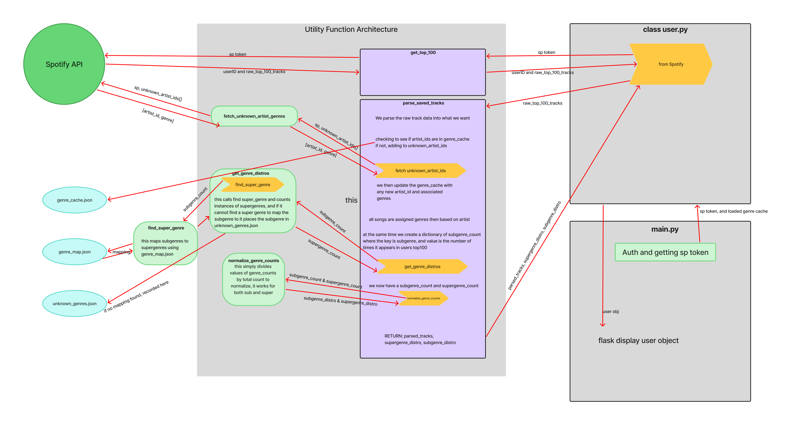

# Utility Function Descriptions

### load_genre_cache(file_path='genre_cache.json')
#### Input: prexisting genre_cache.json or nothing
#### Output: a dictionary with the prexisting genre information or an empty dict
this function simply loads or creates if not there the genre_cache.json. This cache associates artistID with their genres and is used to load genres faster for known artists vs making API calls

### save_genre_cache(genre_cache, file_path='genre_cache.json')
#### Input: genre_cache list and genre_cache.json
#### Output: Updated genre_cache.json
this saves genre_cache.json which is updated with new artistIDs and genres in the event that they are request through API

### def save_unknown_genres(unknown_genres, unknown_genres_file="unknown_genres.json")
#### Input: unknown_genre dictionary
#### Output: unknown_genre.json
Okay this could be mildly confusing considering the last 2 function descriptions. This function does NOT relate to genre_cache.json whatsoever. This refers to the genre_map and subgenre_count. When subgenres are being mapped to supergenres from the genre_map.json if they are NOT found they are added to this list. Ideally it is always empty as all subgenres should map to a supergenre.

### def get_top_100(sp):
#### Input: user's sp auth object
#### Output: RAW top 100 user tracks

### parse_saved_tracks(sp, raw_tracks, genre_cache):
#### Input: user sp auth obj, raw_track data, and genre_cache
#### Output: parsed_tracks, supergenre_distro, subgenre_distro

So this is the workhorse of the utility functions. 
Initially we check all artist IDs against genre_cache.json to see if we can assign a genre to the song immediately, if not in cache we add them to a list called unknown_artist_ids, we will use this later
We then create a new slimmer and flat track object and parse what we want out of the raw track data
Then all artistIDs in the unknown_artist_id[] are fetched from the spotify API
All genres are then added to the tracks (note; technically songs do not have genres, artists do, we are deriving song genre from artist genre)

We iterate through all genres, adding them to subgenre_count which is a dictionary with key being subgenre and value being the count
subgenre_count is then sent to get_genre_distros() and returns all subgenres mapped to a super genre
subgenre_count and supergenre_count are both run through the normalization function which just normalizes the counts against total

parsed_tracks subgenre_distro and supergenre_distro are all returned.

### normalize_genre_counts(genre_counts):
#### Input: subgenre_count or supergenre_count
#### Output: subgenre_distro or supergenre_distro
this just takes in a subgenre_count or supergenre_count and normalizes it by dividing each respective count by count total

### find_super_genre(genre, genre_map_file="genre_map.json"):
#### Input: subgenre
#### Output: supergenre
this just takes in a subgenre and either maps it to its supergenre or returns none, in which case it is logged in unknown_genres.json

### get_genre_distros(subgenre_count)
#### Input:subgenre_count
#### Output:supergenre_count
This is poorly named because it actually does not get the distribution. It more or less only calls find_super_genre() or logs unknown to the json
This and find super genre could be combined probably

### fetch_unknown_artist_genres(sp, unknown_artist_genres)
CONFUSING THIS DOES NOT CORRESPOND TO GENRE MAP, THIS IS ABOUT SPOTIFY API AND GENRE_CACHE
#### Input: A list of unknown artists IDs from the parser
#### Output: A list of genres associated with their artists
